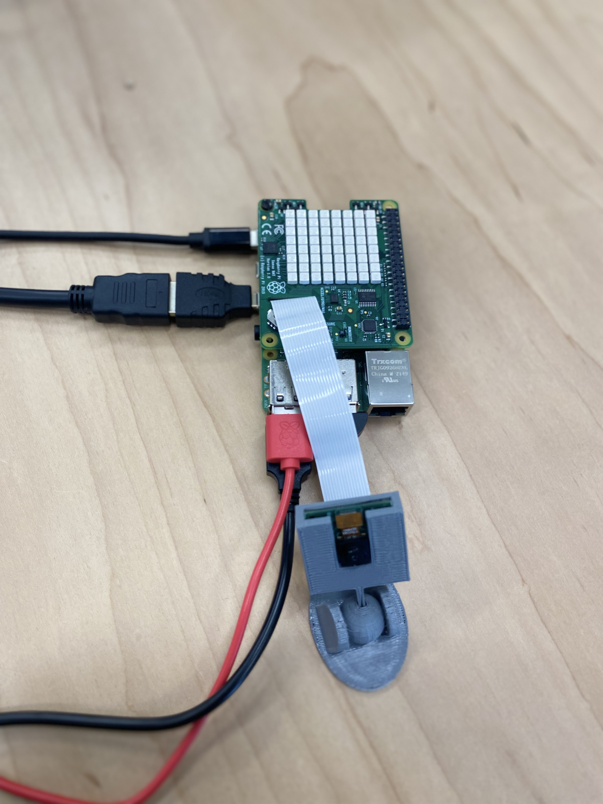

# Camera Voice Recongition
## Created by: Eli and Mario

What we used:
- Python
- Sense Hat
- Pi Camera
- Microphone

| **_Tech_** | **_Description_** |
| ----------- | ----------- |
| **Python** | We used Python to write our code! For example, we used it to create commands that listen to specfic words. If either the words "picture", "burst", or "goodbye" are said then, then Python would act accordingly |
| **Sense Hat** | We used the Sense Hat for a countdown to the pictures! If "picture" or "burst" is said, then it displays a countdown from 3 to 1  |
| **Pi Camera** | We used the Pi Camera to take pictures. We created a 3D print of a Pi Camera stand to have a consistent angle for pictures. |
| **Microphone** | The most important part of the Voice Recongition. It listens to the commands from the user in order to understand what to do. |

# Pictures
